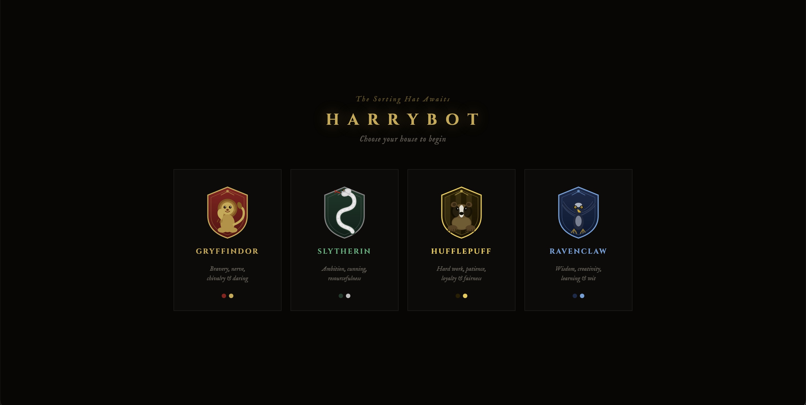
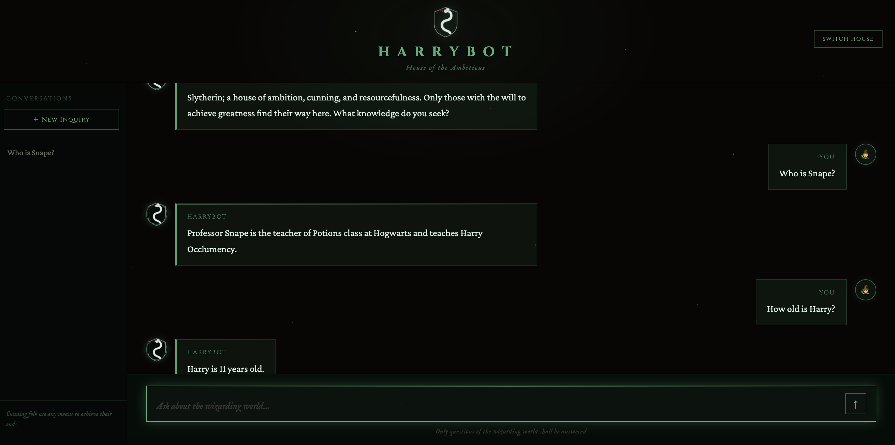

# HarryBot


**Authors:** Burak Ege Kaya-Ufuk Karacali  
**Course:** Applied Large Language Models  
**Instructor:** Ahmet Tugrul Bayrak

---

## Project Overview

HarryBot is a Harry Potter themed chatbot that answers questions strictly based on a provided dataset. It uses a dual FAISS retrieval architecture, the first index covers Q&A questions only and returns direct answers without an API call when a close enough match is found. When no match exists, a second FAISS index covering all data filters the most relevant chunks, which are then passed to the Qwen API via a LangChain Agent.

The system enforces strict rules: it only answers from its dataset, rejects jailbreak and information injection attempts, ignores format manipulation directives at the backend level before the query even reaches the LLM, and persists conversation sessions per house in SQLite so chat history survives across page reloads.

The interface is a web application served by FastAPI. Users choose one of four Hogwarts houses at startup. Each house applies its own color theme, greeting message, and sidebar motto. Conversation history is stored per house and displayed in the sidebar with session titles derived from the first message.

---

## Why We Built It This Way

**Dual FAISS instead of a single vector store.** The dataset contains both Q&A pairs and raw information. For known questions, hitting FAISS-1 directly avoids an API call entirely — faster and cheaper. FAISS-2 handles everything else by providing the LLM with only the most relevant chunks rather than the full dataset.

**LangChain Agent instead of a direct LLM call.** The agent architecture naturally separates the retrieval step from the generation step. Format manipulation attempts are stripped at the backend level in `routers/chat.py` before the query reaches the agent, so the LLM never sees the directive.

**FastAPI with vanilla HTML/CSS/JS instead of Streamlit.** Streamlit imposes layout constraints that would have prevented the house selection screen, the animated SVG crests, and the per-house theming we wanted. (HP geeks decision)

**SQLite for session persistence.** Switching houses or refreshing the page would otherwise erase all conversation history. Each session is tied to a house and its title is set from the first message so the sidebar is readable.

---

## Architecture

```
User (Browser)
      │
      ▼
frontend/index.html + style.css + app.js
      │  House selection → new session created on first message
      │  Chat message    → POST /chat
      │  Load history    → GET  /session/{house}/list
      │
      ▼
main.py (FastAPI)
  ├── routers/chat.py       strip format directives → chat()
  └── routers/session.py    session CRUD

      │
      ▼
src/llm.py (LangChain Agent)
  │
  ├── FAISS-1 check (before agent invocation)
  │     Match found  → return direct answer, no API call
  │     No match     → invoke agent
  │
  └── AgentExecutor
        └── search_harry_potter tool
              └── src/retrieval.py
                    ├── FAISS Index 1 — Q&A questions only
                    └── FAISS Index 2 — all data

      │
      ▼
Qwen API (qwen-plus, OpenAI-compatible)
      │
      ▼
src/context.py — sliding window, last 5 Q&A pairs
      │
      ▼
src/database.py — SQLite, sessions and messages
```

---

## Format Manipulation Protection

Format directives are stripped in two layers.

**Layer 1 — `routers/chat.py`:** Before the query reaches the agent, regex patterns remove phrases like "tell me in 3 words", "answer in 5 words", "just 2", "in Spanish", "be brief". If stripping leaves an empty string (the message was purely a format directive), the last bot answer is returned silently without a new API call.

**Layer 2 — Tool description in `src/llm.py`:** The `search_harry_potter` tool instructs the agent to send only the core Harry Potter question to FAISS, stripping any remaining format noise from the query before retrieval.

---

## Security

| Threat                 | Where handled                                          |
| ---------------------- | ------------------------------------------------------ |
| Jailbreak attempts     | System prompt — JAILBREAK PROTECTION rules             |
| Information injection  | System prompt — INFORMATION INJECTION PROTECTION rules |
| Format manipulation    | Backend regex in `routers/chat.py` + tool description  |
| Prompt confidentiality | System prompt — PROMPT CONFIDENTIALITY rules           |
| SQL injection          | FastAPI + SQLite parameterized queries                 |
| Empty message          | Backend validation before processing                   |

---

## Stack

| Component  | Technology                                      |
| ---------- | ----------------------------------------------- |
| LLM        | Qwen API (qwen-plus, OpenAI-compatible SDK)     |
| Agent      | LangChain AgentExecutor + tool calling          |
| Embeddings | sentence-transformers (all-MiniLM-L6-v2, local) |
| Vector DB  | FAISS (dual index, CPU)                         |
| Backend    | FastAPI + Uvicorn                               |
| Frontend   | Vanilla HTML / CSS / JS                         |
| Session DB | SQLite                                          |
| Data       | pandas + openpyxl                               |
| Tests      | pytest (17 tests)                               |

---

## Project Structure

```
harrybot/
├── frontend/
│   ├── index.html          # House selection + chat UI
│   ├── style.css           # Per-house CSS variables and layout
│   └── app.js              # Session management, fetch calls, SVG crests
│
├── src/
│   ├── __init__.py
│   ├── retrieval.py        # Dual FAISS index build and retrieve()
│   ├── llm.py              # LangChain Agent, tool, FAISS-1 bypass logic
│   ├── context.py          # Sliding window memory: last 5 Q&A pairs
│   ├── database.py         # SQLite — sessions and messages
│   └── models.py           # Pydantic request and response models
│
├── routers/
│   ├── __init__.py
│   ├── chat.py             # POST /chat, format directive stripping
│   └── session.py          # Session CRUD endpoints
│
├── tests/
│   ├── test_retrieval.py   # FAISS index and retrieval tests: 6 tests
│   ├── test_llm.py         # Agent and prompt tests: 6 tests
│   └── test_context.py     # Sliding window memory tests: 5 tests
│
├── prompts/
│   └── system_prompt.txt   # Full system prompt with all protection rules
│
├── data/
│   └── harry_potter_data_02.xlsx
│
├── faiss_index/            # Built on first run, not committed to git
│   ├── index1.faiss        # Q&A questions index
│   ├── index2.faiss        # Full data index
│   ├── qa_answers.pkl
│   ├── qa_questions.pkl
│   └── all_content.pkl
│
├── main.py                 # FastAPI app init, router registration
├── config.py               # API keys, model names, thresholds
├── .env                    # QWEN_API_KEY
├── .gitignore
└── requirements.txt
```

---

## Data

The dataset is `harry_potter_data_02.xlsx` with two columns: `content` and `answer`.

| Type                 | Count | Used in                       |
| -------------------- | ----- | ----------------------------- |
| Q&A pairs            | 20    | FAISS Index 1 + FAISS Index 2 |
| Raw information rows | 130   | FAISS Index 2 only            |
| Total                | 150   | —                             |

---

## Configuration

All constants are in `config.py`.

| Variable             | Default     | Description                                      |
| -------------------- | ----------- | ------------------------------------------------ |
| `QWEN_MODEL`         | `qwen-plus` | Qwen model name                                  |
| `FAISS1_THRESHOLD`   | `0.75`      | Cosine similarity threshold for direct retrieval |
| `TOP_K_CHUNKS`       | `3`         | Chunks passed to LLM from FAISS-2                |
| `MEMORY_WINDOW_SIZE` | `5`         | Last N Q&A pairs kept in context                 |

---

## Screenshots

### House Selection



### Chat Demo



## House Greetings

Each house has its own greeting message and sidebar motto when selected.

| House      | Greeting                                                                                                                                                     |
| ---------- | ------------------------------------------------------------------------------------------------------------------------------------------------------------ |
| Gryffindor | Gryffindor, where the brave at heart find their home. It is our choices that show what we truly are, far more than our abilities. Ask what you will.         |
| Slytherin  | Slytherin; a house of ambition, cunning, and resourcefulness. Only those with the will to achieve greatness find their way here. What knowledge do you seek? |
| Hufflepuff | Hufflepuff; where hard work, patience, and loyalty are prized above all. I will teach the lot and treat them just the same. What would you like to know?     |
| Ravenclaw  | Wit beyond measure is man's greatest treasure. You have found Ravenclaw; where the cleverest always rise to the top. What wisdom do you seek?                |

## Quick Start

**Requirements:** Python 3.9+

```bash
# Clone the repository
git clone https://github.com/burakkeynz/harrybot.git
cd harrybot

# Create and activate virtual environment
python -m venv venv
source venv/bin/activate        # Windows: venv\Scripts\activate

# Install dependencies
pip install -r requirements.txt

# Set your Qwen API key
echo "QWEN_API_KEY=your_key_here" > .env

# Build FAISS indexes (first run only)
python src/retrieval.py

# Start the server
uvicorn main:app --reload
```

Open `http://127.0.0.1:8000` in your browser.

---

## Running Tests

```bash
pytest tests/
```

17 tests across retrieval, LLM, and context modules. All passing.

---

## Challenges & What We Enjoyed

| Topic               | Difficulty | Detail                                                                                                                                                                                                                                            |
| ------------------- | ---------- | ------------------------------------------------------------------------------------------------------------------------------------------------------------------------------------------------------------------------------------------------- |
| Format manipulation | Hard       | Prompt-only solutions did not work; Qwen follows word count directives regardless. Required a two-layer approach: backend regex stripping before the query reaches the agent, combined with tool description instructions to clean FAISS queries. |
| FAISS-1 bypass      | Hard       | Initially FAISS-1 was called inside the LangChain tool, meaning the agent was already invoked before the direct match check. Moving the FAISS-1 check before `agent_executor.invoke()` was the correct fix.                                       |
| Session routing     | Hard       | The GET `/session/{house}/list` and GET `/session/{session_id}/messages` endpoints conflicted in FastAPI because both use a path parameter. Renaming the house endpoint to `/session/{house}/list` resolved the routing collision.                |
| House theming       | Enjoyed    | Building four fully independent themes from a single CSS variable set was satisfying. Each house has its own color ramp, glow, sidebar motto, greeting message, and SVG crest.                                                                    |
| Dual FAISS          | Enjoyed    | Seeing FAISS-1 return instant answers for known questions with no API call, working correctly end to end was the most rewarding part of the retrieval work.                                                                                       |
| LangChain Agent     | Enjoyed    | The tool-calling architecture cleanly separates retrieval from generation. Once the agent was wired correctly, adding new retrieval behaviors required only tool description changes.                                                             |

---

## License

MIT License. Copyright (c) 2026 Burak Ege Kaya — Ufuk Karaçalı.
